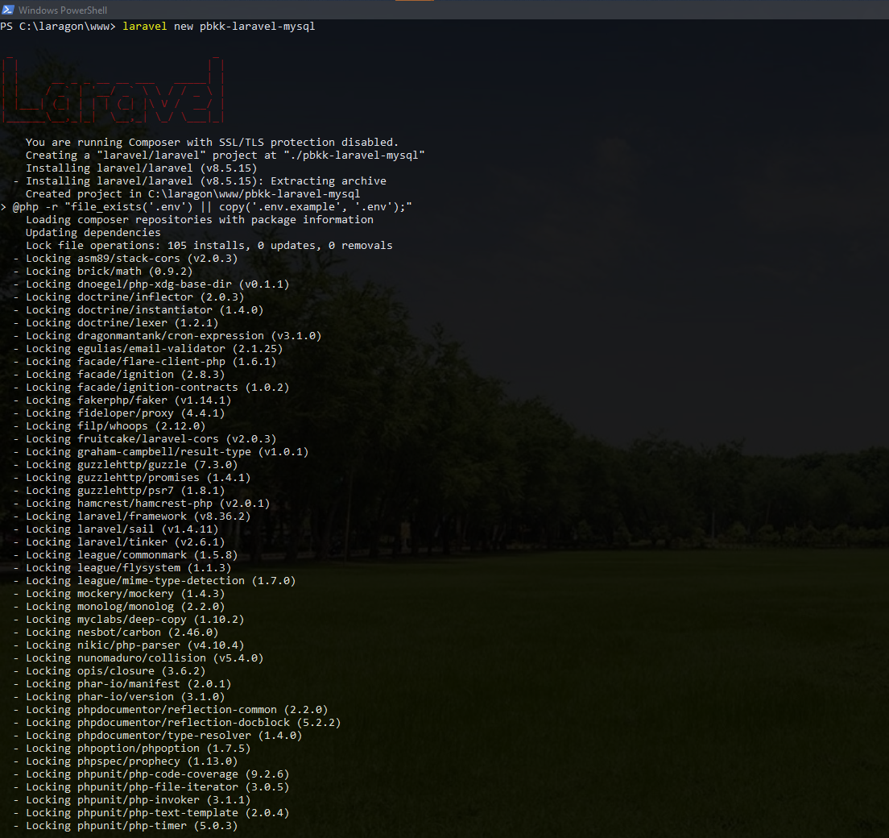

<p align="center"><a href="https://laravel.com" target="_blank"></a></p>

# Tugas Individu PBKK Pertemuan 5
- Nama : I Kadek Agus Ariesta Putra
- NRP : 05111940000105

## Spesifikasi Software
Untuk kebutuhan *web server*,* server side scripting language*, dan *database server* saya menggunakan *software* berikut.

1. Laragon

    - Version : Full
    - Release : 4.0.16

        Dengan:
    - Apache 2.4.46 VC 15
    - PHP 7.4.16
    - MySQL 5.7.24

Kemudian untuk membuat template aplikasi laravel, saya memerlukan software berikut.

1. Composer
    - Version : 2.0.12
    
        Dengan:
    - PHP 7.4.16

## Langkah Instalasi

1. Download [Composer](https://getcomposer.org/download/), lalu menginstallnya.
2. Saat instalasi Composer, pilih versi PHP yang akan digunakan
    
3. Setelah instalasi selesai dilakukan, maka restart Windows untuk merelokasi ulang PATH pada Environment Variables.
4. Untuk memastikan composer telah di install, buka powershell lalu jalankan:
    ```ps
    composer
    ```
    
5. Install requirement laravel
    ```ps
    composer global require "laravel/installer"
    ```
    
6. Lalu pada root directory laragon `\laragon\www\`. Jalankan *command* :
    ```ps
    laravel new pbkk-laravel-mysql
    ```
    
    Setelah selesai, maka akan ada folder baru bernama "pbkk-laravel-mysql" di rood directory laragon.
7. Start laragon service, lalu menuju : http://laravel-pbkk-mysql.test . Maka tampilannya adalah sebagai berikut:
    
---

## Konfigurasi Database
1. Masuk ke http://laravel-pbkk-mysql.test/phpmyadmin dengan username `root` dan tanpa password.
2. Lalu buat user baru:
    
    Otomatis akan terbuat database bernama `pbkk_ariesta`
3. Lalu ubah file .env pada bagian dibawah

    ```env
    DB_CONNECTION=mysql
    DB_HOST=127.0.0.1
    DB_PORT=3306
    DB_DATABASE=pbkk_ariesta
    DB_USERNAME=pbkk_ariesta
    DB_PASSWORD=
    ```

4. Lalu lakukan migrasi dengan cara menjalankan command
    ```ps
    php artisan migrate
    ```
    

5. Migrasi berhasil dilakukan. Tampilan pada database `pbkk_ariesta` adalah sebagai berikut:
    

## License

The Laravel framework is open-sourced software licensed under the [MIT license](https://opensource.org/licenses/MIT).
